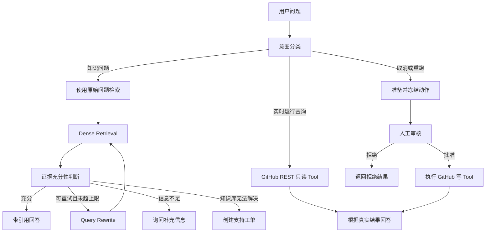

# 00｜项目说明与业务边界

## 1. 项目名称

**EvidenceDesk Agent：可评测的企业技术支持与工单协同 Agent。**

第一版统一产品语境：

```text
GitHub Actions 技术支持与工作流运行协同
```

本项目不是 GitHub 官方产品，也不代表 GitHub 提供支持服务。

## 2. 项目不是普通知识库聊天机器人

普通知识库问答通常只有：

```text
用户问题 → 检索文档 → 模型回答
```

EvidenceDesk Agent 要完成：

```text
识别 GitHub Actions 问题类型
→ 区分知识事实和实时运行事实
→ 检索并验证官方文档证据
→ 必要时调用 GitHub REST Tool
→ 信息不足时澄清
→ 取消或重跑操作等待审批
→ 无法解决时创建支持工单
→ 保存会话状态、审计和评测结果
```

它的工程价值来自真实条件路由、数据持久化、失败处理、人工审核和评测，而不是仅仅导入 LangGraph。

## 3. 目标用户

第一版用户是使用 GitHub Actions 的开发者或运维人员，可能需要：

- 排查 Workflow、Job、Step 失败；
- 理解 YAML 语法、Context、Expression、Variable；
- 排查缓存、Artifact、权限、Secret 和 `GITHUB_TOKEN`；
- 排查 GitHub-hosted 或 Self-hosted Runner；
- 查询某次 Workflow Run 和 Job 的实时状态；
- 创建技术支持工单；
- 取消运行或重新运行失败 Job。

第一版不设计复杂组织、多租户和权限体系。

## 4. 三类核心业务场景

### 场景 A：基于知识库回答

示例：

```text
用户：为什么我的工作流里 ACTIONS_STEP_DEBUG 没有输出调试日志？
```

系统行为：

1. 判断为 GitHub Actions 知识问题；
2. 保留 `ACTIONS_STEP_DEBUG` 等精确标识符；
3. Baseline 使用原始问题进行 Dense Retrieval；
4. 判断证据是否足够；
5. 返回排查步骤和 GitHub Docs 原始页面引用；
6. 如果证据不足，澄清、拒答或建议创建工单。

BM25、Hybrid、Query Rewrite 和 Reranker 属于后续评测实验，不是 Baseline 默认能力。

### 场景 B：调用实时只读 Tool

示例：

```text
用户：帮我查 owner/repo 中 run_id=123456789 的运行状态和失败 Job。
```

系统行为：

1. 判断为实时工作流查询；
2. 提取并校验 `owner`、`repo`、`run_id`；
3. 调用 `get_workflow_run` 和必要时的 `list_workflow_jobs`；
4. 根据 GitHub REST API 的真实返回生成回答；
5. 记录工具名、参数、耗时和结果状态。

这里不能使用 RAG 猜测运行状态，因为实时状态不属于静态知识库。

### 场景 C：人工审核和工单升级

示例：

```text
用户：取消 owner/repo 中 run_id=123456789 的工作流。
```

系统行为：

1. 判断为有副作用的写操作；
2. 查询 Workflow Run 当前状态；
3. 冻结 `cancel_workflow_run(owner, repo, run_id)` 动作；
4. 暂停 LangGraph；
5. 等待人工批准或拒绝；
6. 批准后只在专用演示仓库执行；
7. 保存审批、幂等和 Tool 审计记录。

如果知识库和排查流程无法解决问题，可以在 PostgreSQL 中创建支持工单，并附带已检索证据和已尝试步骤。

## 5. 典型完整流程



## 6. 项目必须具备的功能

### 知识库

- 保留 33 篇 GitHub Actions Source 文档，并在第一次中文 Baseline 中导入 29 篇；
- 保存文档 ID、来源 URL、数据集版本、状态和 checksum；
- 结构优先 + 递归分块；
- 生成 Chunk 并写入 Weaviate；
- Baseline 支持 Dense Retrieval；
- 后续通过实验比较 BM25、Hybrid 和 Reranker；
- 回答必须携带 Chunk、Parent Document 和原始页面 URL。

第一版只验收 Markdown。PDF/TXT 只有在引入真实对应数据源时再增加，不做人为格式转换。

### Agent

- 意图分类；
- 原始问题首次检索；
- 有上限的 Query Rewrite 重试；
- RAG 路由；
- GitHub REST Tool 路由；
- 澄清问题；
- 证据判断；
- 工单升级；
- Human-in-the-loop；
- 最大步数和重试限制；
- Checkpointer 恢复。

### 工程化

- FastAPI；
- PostgreSQL；
- SQLAlchemy；
- Alembic；
- Weaviate；
- 结构化日志；
- 统一错误响应；
- 测试；
- Docker Compose；
- CI；
- 评测报告。

## 7. 第一版明确不做

- 正式前端；
- 多 Agent 协作；
- 语音、图片和视频；
- Kubernetes；
- Kafka、Redis、Celery；
- 完整登录注册；
- 复杂多租户权限；
- Embedding 微调；
- 自己训练大模型；
- 百万级数据和高并发压测；
- 对生产仓库执行取消或重跑操作；
- 为了展示 Loader 而把 Markdown 人为转换成 PDF。

## 8. 已冻结的数据来源

```text
来源：GitHub Docs - GitHub Actions 官方页面
许可：CC BY 4.0
Source Dataset：github-actions-zh-2026-08-05-v1，共 33 篇
Chinese Baseline：github-actions-zh-baseline-v1，共 29 篇
暂时隔离：4 篇英文占主导的参考文档
本地目录：data/knowledge_base/github_actions_zh_v1
```

数据包含：

- 工作流故障排查和日志；
- Workflow Run 管理；
- 缓存和 Artifact；
- Context、Expression、Variable；
- 完整 Workflow Syntax 和 REST API 参考页保留在 Source Dataset，留作多语言实验；
- `GITHUB_TOKEN`、Secret、脚本注入和 Runner 安全；
- Self-hosted Runner；
- GitHub REST Workflow Run、Job 和 Workflow API。

来源、固定提交、页面 URL、SHA-256 和许可记录在 `manifest.json` 与 `ATTRIBUTION.md` 中；第一次实验选择和风险记录在 `baseline_manifest.json` 与 ADR-002 中。

## 9. 如何判断项目成功

### 业务成功

- 知识问题能给出正确 GitHub Docs 引用；
- Workflow Run 实时状态不会从知识库猜测；
- 无答案时能够澄清、拒答或转工单；
- 取消和重跑不会自动执行；
- 写操作只在专用演示仓库验收。

### 检索成功

- Top-K Chunk 能覆盖正确 Parent Document，重复 Chunk 不会重复计为命中；
- `GITHUB_TOKEN`、`ACTIONS_STEP_DEBUG`、YAML Key 等精确标识符可检索；
- 自然语言改写和多文档问题可评测；
- 大型 Workflow Syntax 文档不会因分块丢失标题语义。

### 工程成功

- 一条命令启动；
- 数据库迁移可复现；
- 接口、日志、错误结构统一；
- 测试和评测能够自动运行；
- 能从 Trace 找出错误发生在哪个节点；
- 文档能说明每个设计的理由和代价；
- README 只展示真实运行指标和已验证能力。
