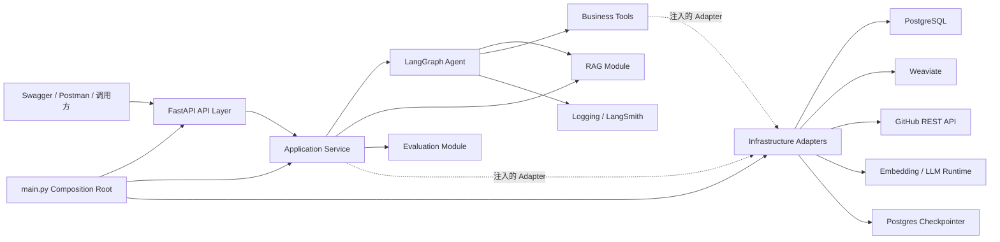

# 02｜系统架构与模块边界

## 1. 架构原则

项目采用：

```text
后端模块化单体
FastAPI 对外
LangGraph 编排
PostgreSQL 保存业务
Weaviate 保存检索索引
```

模块之间通过明确的数据结构协作，不允许所有代码互相直接调用。

## 2. 总体架构



## 3. 分层职责

### API Layer

负责：

- 接收 HTTP 请求；
- Pydantic 校验；
- 身份和 request_id；
- 调用 Application Service；
- 将异常转换成统一响应。

不负责：

- 直接调用 Weaviate；
- 编写 Prompt；
- 执行 SQL；
- 决定 Agent 路由。

### Application Service

负责用例编排：

- 发起聊天；
- 导入文档；
- 创建评测任务；
- 查询评测结果；
- 保存反馈。

它定义事务边界，但不包含模型提示词细节。

### Agent Module

负责：

- State；
- Node；
- Edge；
- 条件路由；
- 重试和终止；
- GitHub Workflow Tool 调用；
- 支持工单升级；
- Human-in-the-loop。

### RAG Module

负责可独立测试的 RAG 规则和数据转换：

- Manifest 数据模型和校验规则；
- Markdown 读取与确定性清洗；
- Section 提取和分块；
- Chunk、检索结果和 Citation 数据结构；
- Dense/BM25/Hybrid 的检索策略参数；
- 证据约束和引用组装。

不负责：

- 创建数据库 Session；
- 保存 Token；
- 初始化 Weaviate Client；
- 下载或管理模型运行环境；
- 直接构造 FastAPI Response。

### Infrastructure Module

负责所有外部 I/O 的具体实现：

- PostgreSQL Session、SQLAlchemy Model、Repository 和 Alembic；
- Weaviate Collection、Indexer 和 Retriever Adapter；
- GitHub REST Client；
- Embedding 模型加载与批量推理；
- LangGraph Checkpointer 连接；
- PostgreSQL、Weaviate 等运行环境探测。

Infrastructure 不决定 Agent 路由、不组织回答、不返回 API Schema。

### Evaluation Module

负责：

- 读取评测数据；
- 批量运行目标版本；
- 计算指标；
- 保存逐题结果；
- 生成实验对比报告。

## 4. 依赖方向

正确方向：

```text
API → Application
Application → Agent / RAG / Tools / Core
Infrastructure → Core，并实现 Application 需要的 Callable 或 Port
main.py → 组装 API、Application 与 Infrastructure
```

错误方向：

```text
API Router 直接创建 psycopg、Weaviate 或 GitHub Client
RAG 代码导入 FastAPI Router
Infrastructure 决定 Agent 路由或业务拒答策略
Repository 调用 Agent Node
SQLAlchemy Model 直接作为 API Response
```

通过接口或 Protocol 隔离外部实现：

```python
class RetrieverPort(Protocol):
    def retrieve(self, query: str, *, top_k: int) -> list[RetrievedChunk]: ...


class TicketRepository(Protocol):
    def create(self, ticket: TicketCreate) -> Ticket: ...
```

这样测试时可以替换为 Fake，不必调用真实模型或数据库。

## 5. 推荐目录

项目采用浅层模块化单体：顶层按能力边界划分，模块内部默认最多再分一层。`main.py` 是 Composition Root，负责把应用用例与真实外部适配器连接起来。

```text
src/evidence_desk/
├── api/
│   ├── routers/
│   ├── schemas/
│   ├── middleware/
│   ├── dependencies.py
│   └── exception_handlers.py
├── application/
│   ├── readiness.py
│   ├── chat_service.py
│   ├── ingestion_service.py
│   ├── evaluation_service.py
│   └── ports/                  # 只有出现 Fake 或第二实现时才创建接口
├── agent/
│   ├── state.py
│   ├── graph.py
│   ├── routes.py
│   ├── prompts.py
│   └── nodes/
├── rag/
│   ├── models/
│   │   ├── source.py
│   │   ├── cleaning.py
│   │   ├── chunk.py
│   │   └── retrieval.py
│   ├── loaders/
│   │   └── markdown.py
│   ├── manifest.py
│   ├── cleaner.py
│   ├── section_extractor.py
│   ├── splitter.py
│   ├── retrieval.py
│   └── citations.py
├── tools/
│   ├── models.py
│   └── policies.py
├── infrastructure/
│   ├── readiness.py
│   ├── postgres/
│   │   ├── session.py
│   │   ├── models.py
│   │   ├── document_repository.py
│   │   ├── ticket_repository.py
│   │   ├── unit_of_work.py
│   │   └── checkpointer.py
│   ├── weaviate/
│   │   ├── schema.py
│   │   ├── indexer.py
│   │   └── retriever.py
│   ├── github/
│   │   └── client.py
│   └── embedding/
│       └── bge.py
├── evaluation/
│   ├── datasets.py
│   ├── metrics.py
│   ├── runner.py
│   └── report.py
├── core/
│   ├── config.py
│   ├── logging.py
│   ├── errors.py
│   └── ids.py
└── main.py
```

### 5.1 分层控制规则

- 顶层按能力划分，不机械复制 Controller/Service/Manager/DAO/Impl 多层 Java 包；
- API 只处理 HTTP；Application 只组织用例；Infrastructure 只处理外部 I/O；
- `main.py` 是唯一允许同时知道 Application 和具体 Infrastructure Adapter 的组装入口；
- 默认目录深度不超过 `evidence_desk/<模块>/<子模块>/<文件>.py`；
- `ports/` 只有在出现 Fake、第二实现或明确替换需求时创建，不为每个类先建接口；
- 不提前创建空目录；路线图进入对应任务时再创建；
- 不使用 `utils.py`、`helpers.py`、全局 `common.py` 收纳无归属代码；
- `rag/models/` 按数据生命周期分组，不采用一个类一个文件，也不回退为单个大型 `models.py`；
- RAG 的纯文本处理和证据规则留在 `rag`；PostgreSQL、Weaviate、GitHub、模型加载等外部实现进入 `infrastructure`；
- 当单个模块超过约 15 个高耦合文件、出现多个正式实现或团队需要独立发布时，再评估增加子模块或独立 Domain Layer。

当前阶段只创建已经被真实代码使用的目录。完整决策见 ADR-003。

## 6. 三种存储的边界

### PostgreSQL

业务真相：

- 文档登记与导入任务；
- 支持工单；
- 待审批动作、审批、幂等和 Tool 审计；
- 评测运行；
- Prompt 版本；
- 用户反馈。

### GitHub REST API

外部实时业务事实：

- Workflow Run；
- Workflow Job；
- Workflow 状态；
- 取消和重新运行结果。

这些实时状态不能由 RAG 或本地数据库猜测。

### Weaviate

检索索引：

- Chunk 文本；
- 向量；
- parent_doc_id；
- metadata；
- 版本和状态。

### LangGraph Checkpointer

运行状态：

- thread_id；
- State；
- messages；
- pending node；
- interrupt。

## 7. 一次聊天请求的数据流

```text
1. FastAPI 校验请求
2. ChatService 创建 request_id/thread_id
3. 调用 compiled_graph.invoke/stream
4. classify_intent 写入 intent
5. 根据路由进入 RAG、GitHub REST Tool 或工单升级
6. Node 只返回 State 增量
7. Checkpointer 保存每一步
8. Graph 生成 final_answer/citations
9. Service 转换成 API Response
10. Middleware 记录耗时与状态
```

## 8. 一次文档导入的数据流

```text
1. API 接收文件或路径
2. PostgreSQL 创建 ingestion_job 并在同一请求内同步执行
3. Loader 解析原文
4. Cleaner 清洗
5. Splitter 生成 Chunk
6. Embedder 批量生成向量
7. Weaviate upsert
8. PostgreSQL 更新文档版本与任务状态
9. 记录 Chunk 数量、耗时、Embedding 版本
```

## 9. 失败边界

- 模型失败：Node 返回可识别错误，按策略重试；
- GitHub Tool 失败：区分认证、权限、限流、资源不存在、超时和上游错误，保存 tool_error，不把 Token 或内部异常直接交给用户；
- Weaviate 失败：RAG Node 失败，不能编造回答；
- PostgreSQL 失败：事务回滚；
- 文档部分写入失败：导入任务标记失败并支持重跑；
- Graph 超过最大步数：进入失败结束节点；
- 高风险操作：必须 interrupt，不能自动继续。

## 10. 为什么这样分层

不是为了目录好看，而是为了：

- 错误能定位到具体层；
- 单元测试可以替换外部依赖；
- 未来更换向量库不改 API；
- Prompt 修改不影响数据库；
- 业务事务不被 Agent 细节污染；
- AI 辅助修改时可以限制写入范围。
