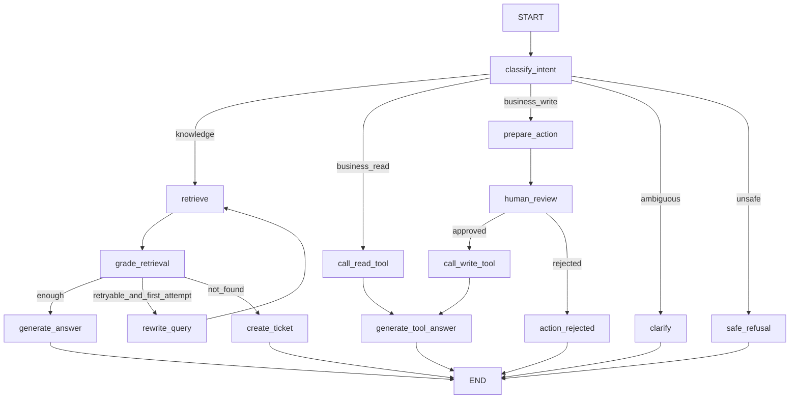

# 04｜Agent 工作流与状态设计

> Agent 的价值不是让模型自由决定一切，而是将不确定的模型判断放入可控制、可观察、有终止条件的工作流。

## 1. 为什么这个项目需要 Agent

如果只有：

```text
问题 → RAG → 回答
```

普通函数或 Chain 就够了。

本项目存在：

- GitHub Actions 知识、实时 Workflow 查询、澄清和人工审核路由；
- 首次检索失败后可能 Query Rewrite；
- 证据不足时不能回答；
- 取消/重跑操作需要暂停；
- Tool 失败需要回退；
- 会话要持久化。

因此使用 LangGraph。

## 2. 第一版图结构



关键约束：第一次知识检索使用 `original_query`。只有第一次证据不足、问题仍可重试且未超过上限时，才进入 `rewrite_query`。

## 3. State 设计

```python
class AgentState(TypedDict):
    messages: Annotated[list[AnyMessage], add_messages]
    request_id: str
    thread_id: str
    user_id: str | None

    intent: str | None
    original_query: str
    rewritten_query: str | None

    retrieved_chunks: list[RetrievedChunk]
    retrieval_attempts: int
    evidence_sufficient: bool | None

    pending_action: PendingAction | None
    tool_results: list[ToolResult]

    final_answer: str | None
    citations: list[Citation]
    error: AgentError | None
```

`PendingAction` 至少保存：

```text
action_id
action_name
owner
repo
run_id
args
reason
risk
idempotency_key
created_at
```

## 4. 为什么 State 只保存必要数据

不应该把以下内容塞进 State：

- 数据库 Session；
- Weaviate Client；
- GitHub API Client；
- LLM Client；
- 大量完整文档对象；
- 不可序列化对象。

原因：Checkpointer 需要序列化和恢复 State。

State 保存“执行事实”，依赖通过 Node 构造或依赖注入获得。

## 5. 每个 Node 的职责

### classify_intent

输入：用户消息。

输出：

```text
knowledge
business_read
business_write
ambiguous
unsafe
```

规则优先识别：

- `owner/repo`；
- `run_id`；
- `GITHUB_TOKEN`、`ACTIONS_STEP_DEBUG` 等精确标识符；
- “取消运行”“重新运行失败 Job”等高风险动作。

其余模糊意图使用 Structured Output，不能解析自然语言字符串猜路由。

### retrieve

第一次输入 `original_query`，重试时输入 `rewritten_query`。

输出带以下字段的候选 Chunk：

```text
chunk_id
parent_doc_id
score
rank
title
source_url
```

不负责生成回答。

### grade_retrieval

判断：

- 是否命中问题中的核心 GitHub Actions 实体；
- 是否有足够证据回答；
- 是否存在范围或版本冲突；
- 是否值得进行一次 Query Rewrite；
- 是否应澄清、拒答或创建支持工单。

第一版使用确定性规则 + LLM Structured Output，不只依赖一个相似度阈值。

### rewrite_query

只在首次召回不足后使用。

规则：

- 保留 `owner/repo`、`run_id`、环境变量、YAML Key、Runner Label 等精确值；
- 不加入用户没有提供的事实；
- 记录 original/rewritten，便于评测；
- 最多执行一次。

### generate_answer

只能使用检索证据回答，输出：

```text
answer
citations
confidence_reason
```

每条 Citation 至少包含：

```text
chunk_id
parent_doc_id
title
source_url
section_path
```

证据不足不能调用该节点。

### call_read_tool

第一版只读 Tool：

```text
get_workflow_run(owner, repo, run_id)
list_workflow_jobs(owner, repo, run_id)
```

真实数据来自 GitHub REST API。CI 使用 Fake GitHub Gateway。

### prepare_action / human_review / call_write_tool

高风险写操作：

```text
cancel_workflow_run(owner, repo, run_id)
rerun_failed_jobs(owner, repo, run_id)
```

必须拆成：

```text
准备并冻结动作
→ 人工确认
→ 使用冻结参数执行
```

只允许在专用演示仓库完成真实写操作验收。

### create_ticket

保存：

- 用户问题；
- 已检索 Parent Document 和 Chunk；
- 已尝试步骤；
- 错误；
- Workflow Run 上下文；
- 会话摘要。

创建工单要求幂等。如果是 Agent 主动建议升级，应先获得用户确认。

## 6. 路由为什么不能全部交给 LLM

确定性信息优先用代码：

- `owner/repo` 格式；
- `run_id` 必须为正整数；
- GitHub Actions 精确标识符；
- 是否出现取消/重跑意图；
- `retrieval_attempts` 是否超过上限。

LLM 处理模糊意图，代码处理明确规则：

```text
规则优先
→ LLM 分类
→ Pydantic 校验
→ Conditional Edge
```

## 7. 循环和终止条件

总检索次数：

```text
MAX_RETRIEVAL_ATTEMPTS = 2
```

含义：第一次原始问题检索 + 最多一次改写后检索。

Graph 最大步骤：

```text
MAX_GRAPH_STEPS = 12
```

Tool 重试：

```text
MAX_TOOL_RETRIES = 1
```

超过上限必须进入：

```text
clarify
create_ticket
safe_refusal
或 failure_end
```

不允许模型自己决定无限继续。

## 8. Checkpointer 和 thread_id

`thread_id` 表示一条可恢复会话。

Checkpointer 保存：

- State；
- 消息；
- 当前节点；
- interrupt；
- 历史快照。

```text
request_id：一次 HTTP 请求链路
thread_id：一段可持续会话和图执行
action_id：一次被冻结、可审批的动作
```

## 9. Human-in-the-loop

暂停前保存：

```json
{
  "action_id": "action_001",
  "action": "cancel_workflow_run",
  "args": {
    "owner": "demo-owner",
    "repo": "evidence-desk-actions-demo",
    "run_id": 123456789
  },
  "reason": "用户请求取消工作流运行",
  "risk": "high",
  "idempotency_key": "..."
}
```

恢复时不能重新让模型生成参数，应使用已经审批的动作。

## 10. Tool 设计

统一返回：

```json
{
  "ok": true,
  "data": {},
  "error": null,
  "metadata": {
    "latency_ms": 30,
    "idempotency_key": "...",
    "external_request_id": "..."
  }
}
```

Tool 必须：

- Pydantic 校验；
- 超时；
- GitHub API 限流识别；
- 日志；
- 错误分类；
- 写操作幂等；
- 不把 Token、内部堆栈或完整敏感响应返回模型。

## 11. Memory 边界

第一版只做：

- Checkpointer 短期会话；
- 必要的会话摘要。

不立即做长期用户偏好记忆。

## 12. Agent 评测

至少评测：

- route_accuracy；
- tool_selection_accuracy；
- tool_args_valid_rate；
- unnecessary_tool_call_rate；
- task_success_rate；
- max_step_violation；
- human_review_required_accuracy；
- write_without_approval_rate，目标必须为 0。

## 13. Agent 设计完成标准

1. 每个 Node 只有一个主要职责；
2. State 字段有明确写入者；
3. 每个 Conditional Edge 有业务理由；
4. 首次检索不做 Query Rewrite；
5. 所有循环有上限；
6. 取消/重跑必经审核；
7. Tool 失败有明确回退；
8. Trace 中能解释一次完整路径；
9. Fake Model/Fake Retriever/Fake GitHub Gateway 可以离线测试图。
